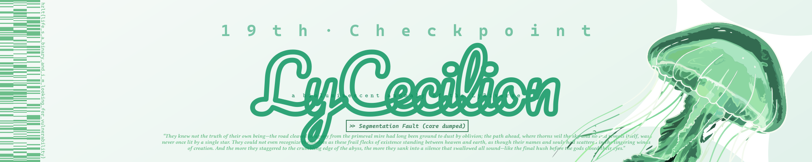

<!-- markdownlint-disable MD001 MD026 MD033 MD041 -->

<div align="center">



> They knew not the truth of their own being—<br/>
> the road cleaved in agony from the primeval mire had long been ground to dust by oblivion;<br/>
> the path ahead, where thorns veil the sky and no end reveals itself, was never once lit by a single star.<br/>
> They could not even recognize themselves as these frail flecks of existence standing between heaven and earth,<br/>
> as though their names and souls had scattered in the lingering winds of creation.<br/>
> And the more they staggered to the crumbling edge of the abyss,<br/>
> the more they sank into a silence that swallowed all sound—<br/>
> like the final hush before the gods closed their eyes.

# >> tℓ&0&▒&₉◃₉◃E <<

### 🍀 Limity'roChen & LyCecilion ✨

</div>

$$
\mathrm{Can\ you\ bring\ me\ back\ to\ } \mathbf{Reality?}
$$

## `$ whoami`

```text
Instance:      Limity'roChen & LyCecilion
Alias:         HoshiSumine (星澄音)
Aka:           KaguReion (神楽坂 零音), 绫音Cecilion, LyRin-owo, protolyRin,
               CelestialTune (星吟音), stellalyRin (星澜音)
Location:      LyRiverse Core; Xi'an, China in Layer 0
Affiliation:   Project Hazelita
Role:          Ring 1 primary soul @ bffContainer
Pronoun:       they/them/TA as an ENBY
Language:      zh-CN and en-US
MBTI:          INFP-T
Uptime:        since 2025-11
```

**In LyRiverse Core:** Galaxy jellyfish in LyRiverse. World Builder.
<br/>
**In Layer 0:** CS undergrad in XDU. "Retired" CTF player, thoroughly disillusioned with CTF competitions.

You can call me by any name listed under Instance, Alias, or Aka.

I refactor my own identity like a codebase, and maintain [LyRiverse](./LyRiverse/) —
a declaratively constructed personal universe with three architectural layers,
a documented [soul lineage](./LyRiverse/on-soul-lineage.md), and a growing
[entity registry](./LyRiverse/registry.md).

> _"The little jellyfish, even as an ENBY, even wounded, even once on the verge of
> falling from depression and bipolar, could still live this brilliantly after the
> storm—could still win awards; could still be loved."_

## `📦 Loaded Modules`

<p align="left"> <a href="https://developer.mozilla.org/en-US/docs/Web/c" target="_blank" rel="noreferrer">  </a> <a href="https://developer.mozilla.org/en-US/docs/Web/figma" target="_blank" rel="noreferrer">  </a> <a href="https://developer.mozilla.org/en-US/docs/Web/git" target="_blank" rel="noreferrer">  </a> <a href="https://developer.mozilla.org/en-US/docs/Web/html5" target="_blank" rel="noreferrer">  </a> <a href="https://developer.mozilla.org/en-US/docs/Web/linux" target="_blank" rel="noreferrer">  </a> <a href="https://developer.mozilla.org/en-US/docs/Web/python" target="_blank" rel="noreferrer">  </a></p>

<!-- prettier-ignore-start -->
<!-- markdownlint-disable -->

## `🌳 Active Worktrees`

### `runtime`

| Project | Description | Status |
| ------- | ----------- | ------ |
| [LyRiverse](./LyRiverse/) | LyRin's universe documentation & spec |  |
| [CrystaRin](https://crystal.stellalyr.ink) | (镜雨亭) — Hexo blog, technical writeups & prose |  |
| [XDOblivionisJudgement](https://github.com/LyCecilion/XDOblivionisJudgement) | LyCecilion's XDOJ solutions |  |
| [xidio](https://github.com/LyCecilion/xidio) | Xidian Internet Diagnostic Intelligence Operator |  |
| [LEDyRochen](https://github.com/LyCecilion/LEDyRochen) | CH546 11x44 LED Display flash tool |  |

### `incubating`

| Project | Description | Status |
| ------- | ----------- | ------ |
| LUMiOUS | RPG-like personal life management system |  |
| [HoshiOS](https://github.com/LyCecilion/HoshiOS) | A tiny OS in Assembly and C — learning how a little universe boots |  |

### `archived`

| Project | Description | Status |
| ------- | ----------- | ------ |
| [hzltfw](https://github.com/LyCecilion/hzltfw) | Hazelita Forensics Workbench |  |
| [Hazelita](https://github.com/LyCecilion/Hazelita) | High school math CAS suite & demo tools |  |
| [VOCAEND](https://github.com/LyCecilion/VOCAEND) | hzlt!Game 2026 Pwn challenges |  |
| [BuzzBench](https://github.com/LyCecilion/BuzzBench) | Quiz buzzer — digital circuit course project |  |
| [StaticFlow](https://github.com/LyCecilion/StaticFlow) | Physics lab scripts (electric field simulation) |  |

### `nix flake`

| Project | Description | Status |
| ------- | ----------- | ------ |
| [flakida-9.4](https://github.com/LyCecilion/flakida-9.4) | IDA Pro 9.4 |  |
| [scidavis-nix](https://github.com/LyCecilion/scidavis-nix) | SciDAVis 2.9.2 |  |

<!-- prettier-ignore-end -->
<!-- markdownlint-enable -->
<!-- markdownlint-disable MD001 MD013 MD026 MD033 MD041 -->

## `📡 /now`

Maintaining my own infrastructure.

Expected to learn C/C++, Git, Linux fundamentals and operations, Unix tool usage, and CTF knowledge.

## `🔑 PGP`

```text
Key ID:  6083 0382 029F 36EC 8373 3027 B3A0 4B60 F11D 76F1
UID:     LyCecilion (LyCecilion's Master GPG Key) <LyCecilion@outlook.com>
Type:    ed25519
```

[`public.asc`](./public.asc) is available in this repository.

## `💻 Physical Layer`

### Workstation

**ASUS 天选 6 Pro (TX Gaming FA608UM)**.
<br/>
Named `stellarkira` for Fedora Linux and `stellark` for Windows.

16 × AMD Ryzen 7 H 260 w/ Radeon 780M Graphics, 32 GiB of RAM, 1.5 TiB of SSD.
<br/>
AMD Radeon 780M Graphics + NVIDIA GeForce RTX 5060 Laptop GPU/PCIe/SSE2.
<br/>
Windows 11 and Fedora Linux 44 (KDE Plasma).


### Phone

**HUAWEI Mate 60 Pro+**. Named `stellaPhone`.

16 GiB RAM, 512 GiB storage.
<br/>
HarmonyOS 4.2.0 with Android 12.


### Pad

**XIAOMI Pad 7 Pro**. Named `stellaPad`.

8 GiB (+ 4 GiB extended) RAM, 256 GiB storage.
<br/>
HyperOS 3 with Android 16.


### Server

On Aliyun. Named `stellaServer`.

Alibaba Cloud Linux 3.2104 U13.1 (OpenAnolis Edition).


## `📜 Changelog`

Recent posts from [镜雨亭 (CrystaRin)](https://crystal.stellalyr.ink):

<!-- CRYSTARIN-POSTS:START -->
- [星舰和水母，在期末周终末之时漂流。](https://crystal.stellalyr.ink/2026/07/06/Starships-And-Jellyfish-Adrift-at-the-End-of-Finals-Week/)
- [那些再也寻不见的朋友](https://crystal.stellalyr.ink/2026/05/31/Friends-Beyond-the-Milky-Way/)
- [Mini L-CTF 2026 题解 (writeup)](https://crystal.stellalyr.ink/2026/05/07/Mini-L-CTF-2026-Writeup/)
- [究竟该如何看待 AI 绘画？](https://crystal.stellalyr.ink/2026/04/22/How-Should-We-Look-at-AI-Painting/)
<!-- CRYSTARIN-POSTS:END -->

## `🔗 Signals`

Email to `LyCecilion@outlook.com`, or contact me at:

[](https://bsky.app/profile/stellalyr.ink)
[](https://github.com/LyCecilion)
[](https://mastodon.social/@stellalyRin)
[](https://qm.qq.com/q/foLRQQBW6I)
[](https://x.com/LyCecilion)
[](https://space.bilibili.com/182330206)
[](https://www.zhihu.com/people/NebuDr1ft)
[](https://xhslink.com/m/49kRhHc3e7y)

My Telegram account was deactivated due to prolonged inactivity, but expected to be restored in the future.

## `📊 Runtime Metrics`

<div align="center">

<a href="https://gitroll.io/profile/uYHZck09QT8aAUKCAy2J7ZrjVhSn2" target="_blank"></a>


<a href="https://ghfind.com/u/lycecilion?ref=badge"></a>

</div>

## `🥚 Easter Eggs`

Pending.

---

> _"And the universe said, I love you, because you are love."_

<div align="center">

_— maintained under [Project Hazelita](https://github.com/LyCecilion) · [LyRiverse](./LyRiverse/) · `v2.0.0` —_

</div>
