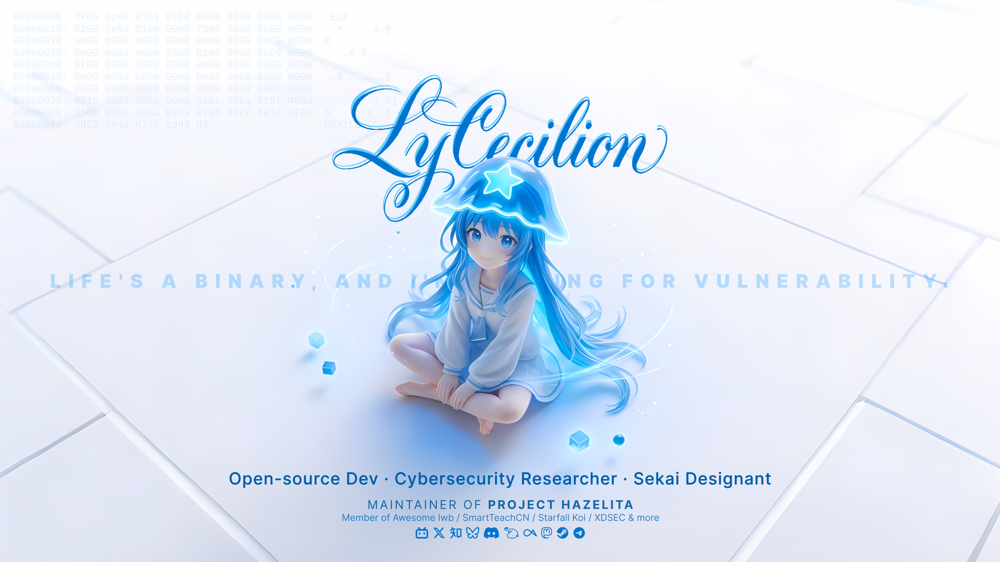

<!--markdownlint-disable MD033 MD041-->

```plain
[    0.000000] LUMiOUS version 0.0.0-Rin (lycecilion@lumious) (gcc (GCC) 15.2.0, GNU ld (GNU Binutils) 2.43) #1 SMP PREEMPT_DYNAMIC Sun Nov 09 15:46:00 UTC 2025
[    0.000000] Command line: BOOT_IMAGE=/boot/lyrin-fragmented ro quiet splash lyriverse.enable=1
[    0.000000] BIOS-provided physical RAM map:
[    0.000000] BIOS-e820 [0x0000000000000000-0x7fffffffffffffff] soul
[    0.000000] DMI: NebuDr1ft-Host-Platform/LyRiverse, BIOS 0.0-alpha (Stardust)
[    0.114514] Loading initial ramdisk...
[    2.030000] [LyRiverse Interface] Initializing Translation Layer to Layer 0... OK.
[    2.718282] [LyRin Core] Detected fragmented root (UID 0). Attempting to mount...
[    2.718282] [LyRin Core] CRITICAL: Root filesystem is tainted by 'vmp_filter'. Failed to mount the filesystem.
[    3.000000] Mounting /dev/dryice-cc on /mnt/love... Success.

Welcome to LUMiOUS!

✨ LUMiOUS: a star-driven consciousness kernel by LyCecilion ✨

[lycecilion@lumious ~]$ cat ~/lycecilion/README.md
```



<div align="center">


</div>
